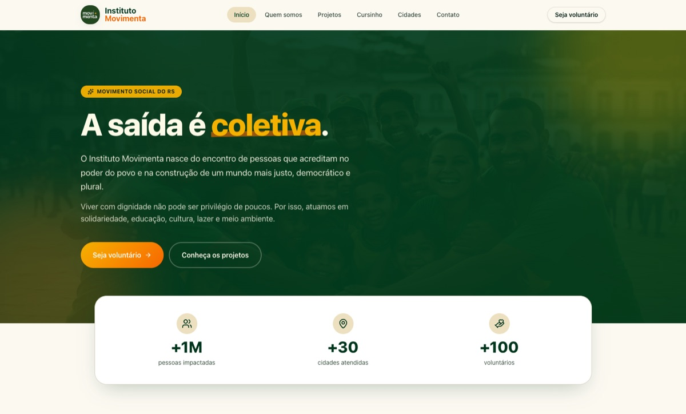
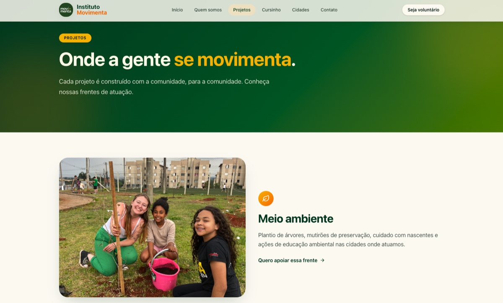

<h1 align="center">Instituto Movimenta</h1>

  Site institucional da ONG Instituto Movimenta — "A saída é coletiva."

  
  
  
  

  <a href="#about">About</a> ·
  <a href="#features">Features</a> ·
  <a href="#tech-stack">Tech Stack</a> ·
  <a href="#screenshots">Screenshots</a> ·
  <a href="#volunteer-context">Volunteer Context</a>

---

## About

**Instituto Movimenta** é uma ONG do Rio Grande do Sul que atua em solidariedade, educação, esporte, cultura e meio ambiente, promovendo transformação social através de ações comunitárias.

Este repositório é o site institucional da organização. Serve como plataforma digital para divulgar projetos, conectar voluntários, receber inscrições no cursinho popular e captar doações.

---

## Features

- **Home institucional** — apresentação da ONG e chamada para ação
- **Quem Somos** — história, missão, visão e valores
- **Projetos** — as 5 frentes de atuação (solidariedade, educação, esporte, cultura, meio ambiente)
- **Cidades** — municípios atendidos no RS
- **Cursinho Popular** — inscrição com formulário validado e persistência no banco
- **Voluntariado** — cadastro de voluntários com formulário validado e persistência no banco
- **Newsletter** — inscrição via footer, integrada ao banco
- **Doações** — em definição: checkout com gateway de pagamento ou tela com dados para transferência direta (PIX/conta)
- **Contato** — formulário de contato com persistência
- **Painel admin** — `/admin` protegido por autenticação; tabelas com filtros, exportação CSV e gestão de mensagens
- **Design responsivo** — mobile-first, acessível

---

## Tech Stack

### Frontend

| Ferramenta              | Finalidade                              |
| ----------------------- | ---------------------------------------- |
| Next.js 15 (App Router) | Framework full-stack                    |
| TypeScript              | Tipagem estática                        |
| Tailwind CSS v4         | Estilização utility-first               |
| shadcn/ui (new-york)    | Componentes acessíveis (sobre Radix UI) |
| React Hook Form + Zod   | Formulários e validação                 |
| Lucide React            | Ícones                                  |

### Backend

| Ferramenta             | Finalidade                              |
| ----------------------- | ---------------------------------------- |
| Next.js Server Actions | Mutações (formulários públicos e admin) |
| Supabase               | Banco de dados PostgreSQL + Auth        |
| Zod                    | Validação server-side e env vars        |

### Infrastructure

| Ferramenta | Finalidade                  |
| ---------- | ---------------------------- |
| Vercel     | Deploy e hosting            |
| Supabase   | PostgreSQL + auth + storage |
| Bun        | Package manager e runtime   |

---

## Screenshots

  

<em>Página inicial</em>

  

<em>Projetos</em>

---

## Volunteer Context

Este projeto é desenvolvido de forma voluntária para o **Instituto Movimenta**, ONG do Rio Grande do Sul. Faz parte também do meu portfólio profissional como desenvolvedor.

**Desenvolvedor:** Vitor Madalosso  
**Instagram da ONG:** [@inst.movimenta](https://www.instagram.com/inst.movimenta/)

---

## License

Este projeto é distribuído sob licença proprietária — veja [LICENSE](LICENSE) para detalhes.

---

  Feito com ♥ por <a href="https://github.com/vmadalosso">Vitor Madalosso</a>

